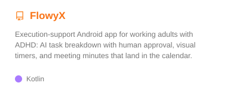
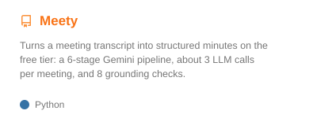
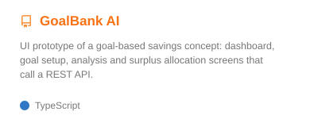
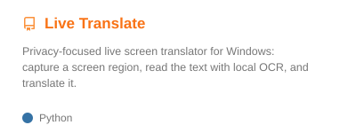

  

## About Me

I am an **Artificial Intelligence undergraduate at the University of Technology Sydney** (TNE programme with HCMUT, Ho Chi Minh City) and a **Research Assistant at URA Research Group**. I work where a business problem meets AI: finding out what people actually need, mapping the process in **BPMN 2.0**, and designing the LLM pipeline that fits it.

In team projects I usually take the **lead and analyst seat**: requirements discovery, solution architecture, and pipeline design with **grounding checks**, **rule-based validation**, and **human approval** before anything is saved. The code is built through **AI-assisted development** that I direct.

I am looking for an **internship in AI solutions or business analysis in Ho Chi Minh City**, and I am happy to connect with engineers, analysts, and researchers working on practical AI.

---

## Featured Projects

<table width="100%">
  <tr>
    <td width="50%" valign="top">
      
      <ul>
        <li><b>Event:</b> RMIT ADC Hackathon 2026 · Neurodivergence</li>
        <li><b>Role:</b> Project Manager &amp; Business Analyst</li>
        <li><b>Tech:</b>   </li>
      </ul>
    </td>
    <td width="50%" valign="top">
      
      <ul>
        <li><b>Event:</b> Personal project</li>
        <li><b>Role:</b> Founder &amp; Solution Developer</li>
        <li><b>Tech:</b>   </li>
      </ul>
    </td>
  </tr>
  <tr>
    <td width="50%" valign="top">
      
      <ul>
        <li><b>Event:</b> Top 40 · Vietnamese Student HackAIthon 2026</li>
        <li><b>Role:</b> Project Manager &amp; Solution Architect</li>
        <li><b>Tech:</b>   </li>
      </ul>
    </td>
    <td width="50%" valign="top">
      
      <ul>
        <li><b>Event:</b> Personal project</li>
        <li><b>Role:</b> Solo developer</li>
        <li><b>Tech:</b>   </li>
      </ul>
    </td>
  </tr>
</table>

---

## GitHub Analytics

  
  

## Tech Stack

| Domain | Technologies |
| :--- | :--- |
| **Solution Engineering** |    |
| **AI & LLMs** |    |
| **Backend & Data** |     |
| **Frontend** |    |
| **Tools** |    |
